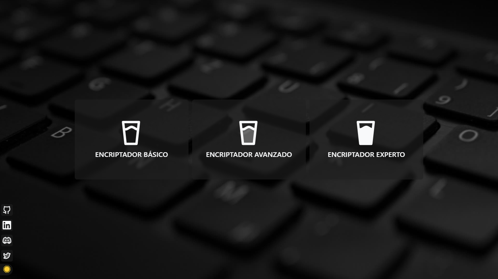

# Encriptador Texto V3

El resultado del mismo

Tiene una pantalla de inicio para que puedas elegir que tipo de encriptador vas a usar, podrás descargar el mensaje encriptado/desencriptado!

Con las combinaciones de tecla `SHIFT` + `D` podrás cambiar de modo **Dark**/**Light**

Tiene 3 formas de encriptación:
 - La básica: Esta es la que tiene la versión 1
 - La Avanzada: Es otra forma de encriptar sin texto
 - La Experta: Este encripta/desencripta mucho mejor

